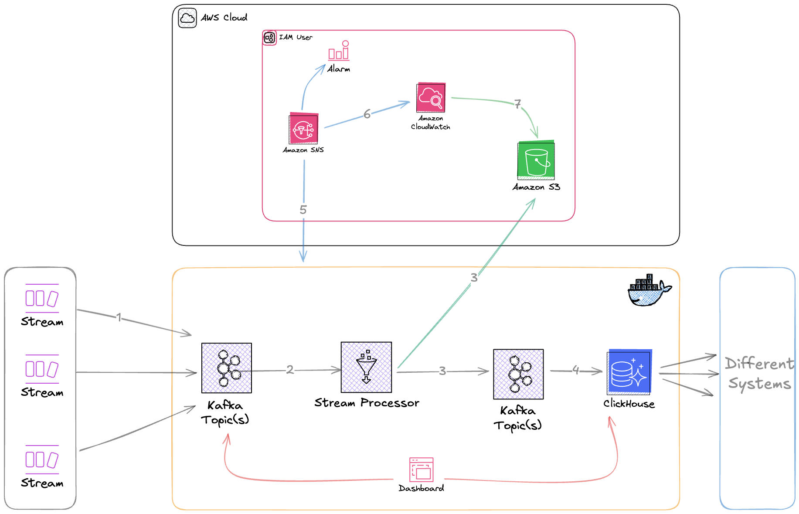

# Network Telemetry Data Pipeline

A real-time data streaming and processing pipeline for network telemetry data. This project simulates ingesting network telemetry data into Kafka, processing it with QuixStreams, and storing it in ClickHouse for analysis.

## Architecture

The pipeline consists of the following components:

1. **Data Simulator**: Generates simulated network telemetry data and sends it to Kafka.
2. **Stream Processor**: Processes raw data using QuixStreams and sends it to multiple Kafka topics.
3. **ClickHouse Ingestion**: Consumes processed data from Kafka and inserts it into ClickHouse tables.
4. **AWS S3 Storage**: Stores processed data as Parquet files for long-term storage.
5. **AWS SNS Alerting**: Sends alerts for errors and failures in the pipeline.



## Technology Stack

- **Apache Kafka (KRaft mode)**: Used for message streaming without requiring Zookeeper
- **Kafka UI**: Web-based UI for monitoring Kafka
- **ClickHouse**: Column-oriented database for analytics
- **Tabix**: Web-based UI for ClickHouse
- **QuixStreams**: Python library for stream processing
- **Logfire**: Structured logging solution

## Project Structure

```
.
├── .env                        # Environment variables
├── .env.example                # Example environment variables
├── .github/                    # GitHub workflows and templates
├── Makefile                    # For automating setup and execution
├── README.md                   # This file
├── bosta-architecture.png      # Architecture diagram
├── config/                     # Configuration files
│   └── clickhouse/             # ClickHouse configuration
├── data/                       # Data storage directory
├── docker-compose.yml          # Docker Compose file for infrastructure
├── logs/                       # Log files
├── processor/                  # Core processing components
│   ├── parsers/                # Data parsing logic
│   ├── producers/              # Kafka producer implementations
│   ├── storage/                # Storage adapters for ClickHouse/S3
│   └── utils/                  # Utility functions
├── schema/                     # Schema definitions
│   ├── clickhouse_tables.py    # ClickHouse table creation
│   └── models.py               # Pydantic models for data validation
├── simulator/                  # Data simulator
│   ├── README.md               # Simulator documentation
│   ├── requirements.txt        # Simulator dependencies
│   ├── src/                    # Simulator source code
│   └── test_data.json          # Sample telemetry data
└── streamprocessor/            # Stream processing components
    ├── Dockerfile              # Dockerfile for the stream processor
    ├── README.md               # Stream processor documentation
    ├── alerts.py               # Alert handling
    ├── common.py               # Common utilities
    ├── parser.py               # Data parsing
    ├── processor.py            # Main stream processor
    ├── requirements.txt        # Stream processor dependencies
    └── s3_exporter.py          # S3 export functionality
```

## Prerequisites

- Docker and Docker Compose
- Python 3.9+
- Recommended: UV package manager for Python dependency management

## Setup

1. **Install UV (Recommended)**:

   Follow the [official UV installation guide](https://github.com/astral-sh/uv).

2. **Configure environment variables**:

   Copy the `.env.example` file to `.env` and update the values as needed:

   ```bash
   cp .env.example .env
   ```

3. **AWS Configuration (optional)**:

   If you want to use AWS S3 for storage and SNS for alerting, update the following environment variables in the `.env` file:

   ```
   AWS_REGION=us-east-1
   AWS_ACCESS_KEY_ID=your-access-key
   AWS_SECRET_ACCESS_KEY=your-secret-key
   AWS_S3_BUCKET=network-telemetry-data
   AWS_SNS_TOPIC_ARN=arn:aws:sns:us-east-1:123456789012:network-telemetry-alerts
   ```

## Usage

### Running with Make (Recommended)

The easiest way to run the entire pipeline is using the provided Makefile:

```bash
# Start the entire pipeline
make run

# Stop the pipeline
make stop

# Clean up all data
make clean
```

The Makefile automates:
- Environment variable checks
- Dependency validation
- Directory setup
- Service startup
- Schema creation
- Pipeline process management
- Logging (logs stored in the `logs` directory)

Additional make targets:
```bash
# Only check environment variables and dependencies
make check-env check-deps

# Only set up directories and install dependencies
make setup

# Only start the Docker services
make start-services

# Only create Kafka topics and ClickHouse tables
make create-schemas

# Only start the pipeline components
make start-pipeline
```

### Running Components Individually

#### Simulator

```bash
# Navigate to the simulator directory
cd simulator

# Install dependencies
pip install -r requirements.txt

# Run the simulator
python src/simulator.py
```

#### Stream Processor

```bash
# Navigate to the streamprocessor directory
cd streamprocessor

# Install dependencies
pip install -r requirements.txt

# Run the processor
python processor.py
```

### Monitoring the Pipeline

- **Kafka UI**: Open http://localhost:8080 in your browser to access the Kafka UI dashboard.
- **ClickHouse Tabix**: Open http://localhost:8081 in your browser to access the ClickHouse Tabix UI.
- **Container Logs**: Use `docker-compose logs -f` to view logs from all containers.
- **Component Logs**: Component logs are available in the `logs` directory.

## Data Model

The pipeline processes network telemetry data into three main entities:

1. **Node Data**: Information about network nodes.
2. **Interface Data**: Information about network interfaces associated with nodes.
3. **Address Data**: IP address information associated with interfaces.

### ClickHouse Tables

The schema for ClickHouse tables is defined in `schema/clickhouse_tables.py`. The main tables are:

- `node_data`: Stores information about network nodes
- `interface_data`: Stores information about network interfaces
- `address_data`: Stores IP address information

## Logging

This project uses Logfire for logging. To configure Logfire:

1. Create a Logfire account and obtain a token.
2. Set the `LOGFIRE_API_KEY` environment variable in the `.env` file.

## AWS Integration

### S3 Storage

Processed data is stored in S3 as Parquet files. The implementation is in `streamprocessor/s3_exporter.py`. The files are organized by timestamp:

```
s3://network-telemetry-data/processed/YYYY/MM/DD/HH/batch-id.parquet
```

### SNS Alerting

Alerts are sent to SNS when errors occur in the pipeline. The implementation is in `streamprocessor/alerts.py`. Configure the `AWS_SNS_TOPIC_ARN` environment variable to enable alerting.

## Development

### Adding New Data Sources

To add a new data source:

1. Create a new simulator component or extend the existing one in the `simulator` directory
2. Update the parser in `streamprocessor/parser.py` to handle the new data format
3. Update the data models in `schema/models.py`
4. Create new ClickHouse tables if needed in `schema/clickhouse_tables.py`

### Adding New Processing Logic

To add new processing logic:

1. Update the QuixStreams processor in `streamprocessor/processor.py`
2. Create new output topics in Kafka
3. Add new storage adapters in the `processor/storage` directory

## Troubleshooting

### Common Issues

- **Kafka Connection Errors**: Make sure Kafka is running and the `KAFKA_BOOTSTRAP_SERVERS` environment variable is set correctly.
- **ClickHouse Connection Errors**: Check that ClickHouse is running and the connection parameters are correct.
- **AWS Permission Errors**: Verify your AWS credentials and make sure the IAM user has the necessary permissions.
